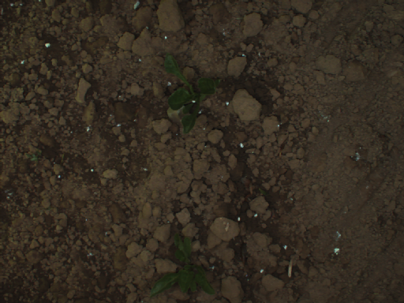
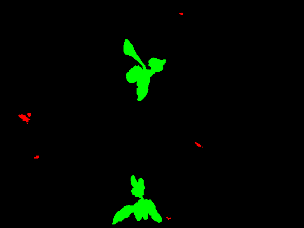
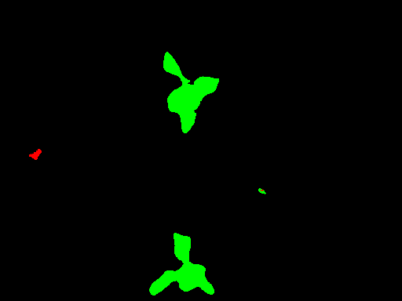

# Weed Detection in Sugar Beet Plants

Implementation of the paper Real-time Semantic Segmentation of Crop and Weed for Precision Agriculture Robots Leveraging Background Knowledge in CNNs [[link]](https://arxiv.org/abs/1709.06764)

### Code Requirements
You can install Conda for python which resolves all the dependencies for machine learning.  
**pip install requirements.txt**

### Dataset
Dataset URL - [http://www.ipb.uni-bonn.de/data/sugarbeets2016/](http://www.ipb.uni-bonn.de/data/sugarbeets2016/)
```
@article{chebrolu2017ijrr,
title = {Agricultural robot dataset for plant classification, localization and mapping on sugar beet fields},
author = {Nived Chebrolu and Philipp Lottes and Alexander Schaefer and Wera Winterhalter and Wolfram Burgard and Cyrill Stachniss},
journal = {The International Journal of Robotics Research},
year = {2017}
doi = {10.1177/0278364917720510},
}
```
### Data Preprocessing
- The dataset was not uniform and it needed to be processed so that all the Original RGB images and Groudtruth images would match each other.
- The Groudtruth images were segmented in different classes and we needed only the classes - `crop, weed and background`. The classes that were not required were converted to the background class.
- So the next step was to generate all the annotations from the groundtruth.
- `Groundtruth` refers to the image where crop, weed, and background is segmented as different colours in RGB space. 
- `Annotation` refers to the image where we assign different classes to the different colours which indicate the different objects.
- Refer the `prepareData.py` for further processing.


### Model Working
**CNN based Encoder - Decoder Network with Residual Blocks.**  
This type of model comprises of two major parts – `encoder & decoder`. The encoder takes the input image and converts it into a feature volume in the latent space. This feature volume is then fed to the decoder to output the segmented image. `Residual blocks` formed the building blocks of ResNet. They are also called skip connections which forward the activations of a previous layer to a deeper layer. This helps in training very deep neural networks faster and avoids the issue of increasing error when more layers are introduced in a network.  
  
The input to this model is an RGB image that is stacked with 11 more channels like vegetation indexes, HSV colour space, operators on the indices such as the Sobel derivatives, the Laplacian, and the Canny edge detector. The `14-channel` input helps in the training and generalization of the model due to a small dataset and a wide variety of environmental conditions.  
The output is an RGB segmented image of crop, weed, and background.  
Refer the `model.py` for the same.

### Results
Input Image             |       Groundtruth Image      |  Predicted Image
:-------------------------:|:-------------------------:|:-------------------------:
  |   |  


